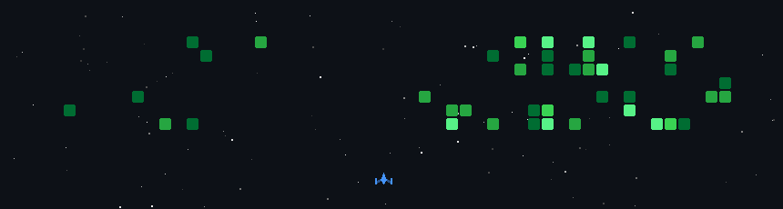

# AYMEN ECHCHALIM
**ML Engineer · Data Scientist · Builder** ⵣ

*Engineering clarity from complexity. I build dependable AI systems, not just hype.*

---

## 👨‍💻 About Me

Data scientist based in Casablanca. I prefer building robust, agentic workflows and production-grade data products over collecting buzzwords. If you want the formal resume and certifications, feel free to check out my [LinkedIn](https://linkedin.com/in/echchalim). Here, it's all about the code.

**Currently geeking out on:**
- 🎙️ Building a voice chatbot for **Moroccan Darija** using multimodal models like Qwen2-Audio and Gemma-3n.
- 🤖 Exploring in depth agentic systems 
- 📈 Mixing Deep Learning and Reinforcement Learning (LSTM/xLSTM + PPO/A2C) for stock market prediction.
- 🦀 Exploring **Rust** to optimize heavy Python pipelines.
- 📝 Ditching LaTeX for **Typst** whenever humanly possible.

---

## 🚀 What I Build

I focus on **RAG, NLP, and Agentic Systems**. Some of my favorite creations:
- **Legal RAG System:** Automated analysis for Moroccan legal docs with 98% retrieval precision.
- **CAN2025 Assistant:** A multimodal, agentic copilot for the recent Africa Cup of Nations.
- **Lumina Bank Copilot:** A privacy-first, secure banking assistant with strict tool-access controls.

---

## 🛠️ Stack

`Python` `PyTorch` `FastAPI` `GCP` `Docker` `Hugging Face`  `Google ADK` `Qdrant`  `Langgraph`  `LangChain`

---

## 📊 The Metrics

 

### 👾 Defend My GitHub!
*More contributions = stronger enemies. Good luck.*

